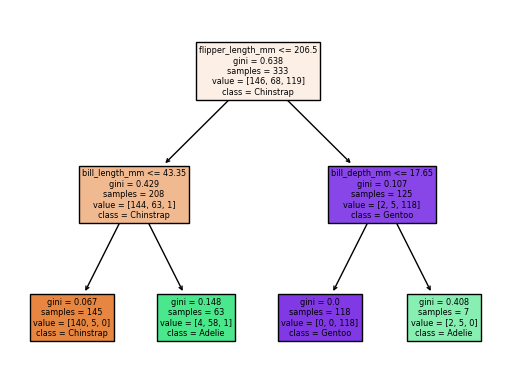

For this comparison, I will compare the `scikit-learn` library in `Python` and the newly developed `tidymodels` meta-package in `R`. The main reason that I have chosen these two is because they share a lot of similarities and imposed strict frameworks in data pre-processing, modelling and evaluations. 

The data that I will use is the `penguins` data from the `R` package `palmerpenguins`, which you can learn more about [here](https://allisonhorst.github.io/palmerpenguins/articles/intro.html). The response variable is a `factor` variable, `species`, indicating the species of a penguin. The other predictor variables are a mix of both numeric and factor variables. For convenience, I have extracted the data below in a CSV format so that Python can also use this data through `pd.read_csv`

```{r, eval = FALSE}
library(palmerpenguins)
library(tidyverse)
readr::write_csv(penguins %>% na.omit, path = "data/penguins_complete.csv")
```

# Importing data and getting a summary 

<div class="left">

## `R`: `tidyverse`

```{r, message = FALSE}
library(tidyverse)
penguins = readr::read_csv(file = "data/penguins_complete.csv")
penguins %>% colnames()
```

</div>

<div class="right">

## `Python`: `pandas`

```{python}
import pandas as pd
penguins = pd.read_csv("data/penguins_complete.csv")
penguins.columns
```

</div>

<div style="margin-bottom:1000px;">
</div>


# Decision tree classification

<div class="left">

## `R`: `rpart`

```{r, message = FALSE}
##
##
##
##
##
##
##
##
library(rpart)
library(rpart.plot)

feature_set = c('bill_length_mm', 'bill_depth_mm', 'flipper_length_mm', 'body_mass_g')
sub_penguins = penguins[,c('species', feature_set)]
dtc_model = rpart::rpart(species ~ ., data = sub_penguins)
table(sub_penguins$species, 
      predict(dtc_model, type = "class"))

rpart.plot(dtc_model)
```

</div>

<div class="right">

## `Python`: `pandas`

```{python}
# from sklearn.model_selection import cross_val_score
from sklearn.tree import DecisionTreeClassifier
from sklearn import tree
import matplotlib as plt
from sklearn.metrics import confusion_matrix

feature_set = ['bill_length_mm', 'bill_depth_mm', 'flipper_length_mm', 'body_mass_g']
X = penguins[feature_set]
y = penguins.species
dtc_model = DecisionTreeClassifier(random_state = 1, max_depth = 2)

# Fit model

dtc_model.fit(X, y)

confusion_matrix(y, dtc_model.predict(X))
```

```{python, results = "hide"}
##
##
##
plt.pyplot.figure()
tree.plot_tree(dtc_model, filled = True, feature_names = feature_set, class_names = list(set(list(penguins.species))))
plt.pyplot.savefig('figures/py_penguins_decision_tree.png', format = 'png', bbox_inches = "tight")
```



</div>

<div style="margin-bottom:1500px;">
</div>

## Some alternatives

`R` benefits greatly from contributions from the community and there are mamy ways of performing the task albeit with improvements over the standard solution, often with a slightly more considerations for the user experience. `treeheatr` is a good example of this. It improves on the tree diagram and uses an additional heatmap for visualisation while keeping the API simple. 

```{r, message = FALSE, fig.height = 5, fig.width = 10}
library(treeheatr)

heat_tree(sub_penguins, target_lab = 'species')
```

# Splitting data into train-test sets

<div class="left">

## `R`: `rpart`

</div>

<div class="right">

## `Python`

```{python}
from sklearn.model_selection import train_test_split

train_X, test_X, train_y, test_y = train_test_split(X, y, random_state = 0)

dtc_train_model = DecisionTreeClassifier(random_state = 1, max_depth = 2)
dtc_train_model = dtc_train_model.fit(train_X, train_y)
dtc_predictions = dtc_train_model.predict(test_X)
```

```{python}
from sklearn.metrics import classification_report

cr = classification_report(
y_true = test_y, 
y_pred = dtc_predictions)

print(cr)
```

</div>

# Splitting data through k-fold cross-validation scheme
